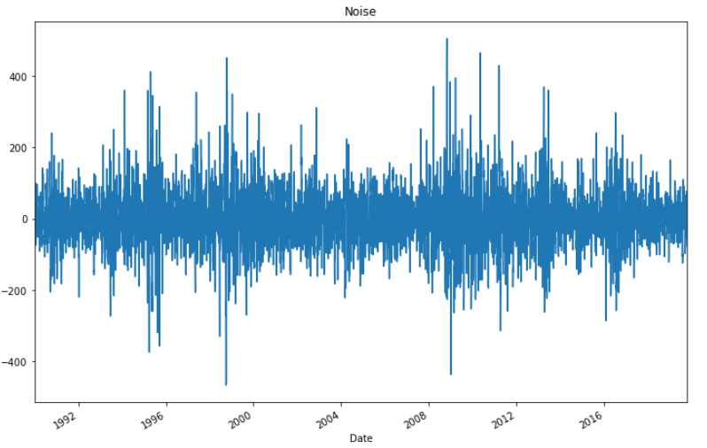

# **Time Series Forecasting Analysis**
## By Franklin Vaca

## **Questions:**
### **Q1: Based on your time series analysis, would you buy the yen now?** 

>
The ARMA and ARIMA models are not able to capture the behavior of the Yen settle prices. As indicated on the answer to Q3, the estimated coefficients for the models are not statistically significant and on top of that the GARCH model indicates that volatilty is expected to increase. I would not advise to buy yen now given the high volatility and the fact that these models do not fit the data as expected. 
 

*Yen Futures Prices Plot*

*ARMA Model Output*

*ARIMA Model Output*

### **Q2: Is the risk of the yen expected to increase or decrease?** 
>
The upward trend shown on the 5 Day Forecast of Volatility plot (using GARCH) indicates that the volatility (risk) is expected to increase. The coefficients from the GARCH model are statistically significant (p<0.05).  
 

### **Q3: Based on the model evaluation, would you feel confident in using these models for trading?** 
>
Based on the Yen Futures Settle Prices plot and the output from the Hodrick-Prescott Filter, we can see that the data follows a nonstationary model would fit the data better. I also ran the Augmented Dickey-Fuller test (below) to check if the data is stationary. The result (p-value>0.05) supports the premise that the data is nonstationary.

>
I would not feel confident with these models (ARMA, ARIMA) based on the fact that none of the estimated coefficients were statistically significant (p<0.05). When comparing the Log Likelihood values, the ARMA model (Log Likelihood=-7894.071) performs better than the ARIMA model (Log Likelihood=-41944.619). The AIC (Akaike Information Criterion) of the ARMA model is lower than the AIC for the ARIMA model, lower values on the AIC denote a better fit. But, as previously indicated the data is nonstationary therefore, ARMA would not be the best model for this situation.    
 

*Hodrick-Prescott Filter*

# **Linear Regression Forecasting Analysis**
## By Franklin Vaca
### **Q4: Does this model perform better or worse on out-of-sample data compared to in-sample data?** 
>
The out-of-sample RMSE is lower than the in-sample RMSE. RMSE is tipically expected to be lower for training (In-Sample) data. RMSE is a measure of how concentrated our data is around the predicted line. Based on the RMSE information, predictions in the out-of-sample (test) dataset are slightly better than those observed in the in-sample (training) dataset. 

> In-Sample Root Mean Squared Error (RMSE): 0.5963660785073426  

> Out-of-Sample Root Mean Squared Error (RMSE): 0.4154832784856737

